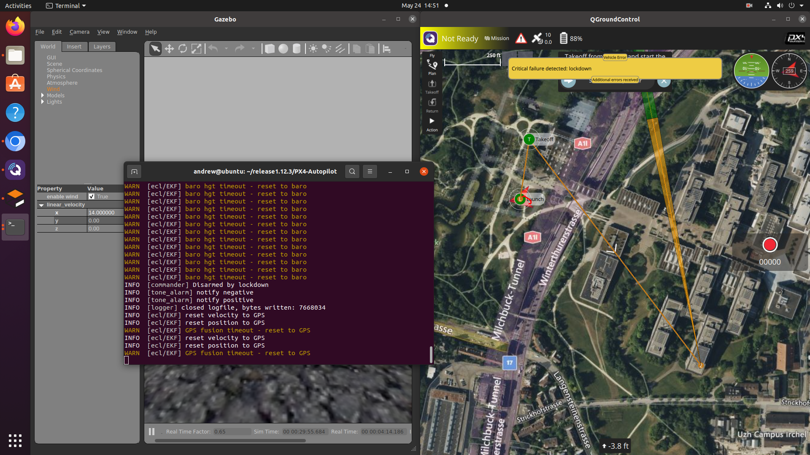

# An exploratory study of bug reproduction in UAVs sytems : PX4 case study


# Replication
## bug #18576
| GitHub bug link |  https://github.com/PX4/PX4-Autopilot/issues/17323   |
|-----------------|---------------------------------------------|
| Code Release         | v1.11.3                                 |
| Os version           | Ubuntu 20.04                                      |
| Vehicle model        | Tailsitter                                             |
| Simulator type       | Gazebo SITL                                       |
| Bug Description      | It is no longer possible to fly a mission with the SITL tailsitter model. The model oscillate crazily and does not reach waypoints. To Reproduce Steps to reproduce the behavior:make px4_sitl gazebo_tailsitter Uploaded mission plan attached to this issue in QGC. Start mission                                 |
| Expexted Behavior    | It should follow the waypoints and not oscillate and fly away.                                 |
| Observed Behavior    | The Tailsitter oscillate crazely and the dashbord show troubled before it takes off and it do not reach well in the waypoints.                                  |
| Output               | Here the output is the behavior of the vehicle observed in QGroungcontroller tool inteface.                                 |
##### Step to Reproduce


1. clone px4 software form github official repository :
    ```bash
    git clone https://github.com/PX4/PX4-Autopilot.git --recursive
    ```
2. clean submodules from main branch :
    ```bash
    make clean
    ```
    ```bash
    make distclean
    ```
3. checkout to the branch release :
    ```bash
    git checkout v1.12.3
    ```
4. update submodules for the new release :
    ```bash
    make submodulesclean
    ```
5. execute the following commands inside terminal :
    ```bash
    make px4_sitl gazebo_plane__windy
    ```
    - Configure the Gazebo simulator by setting the wind velocity to (14, 0, 0) for the x, y, and z components
    - Configure GroundControl by planning a mission with the takeoff waypoint's parameter 4 set to 90
    - launch the mission and observe the behavior of the vehicle


Watch bellow the setting and behavior observed
[Reproduction](https://youtu.be/pU18PCdoAwU)
